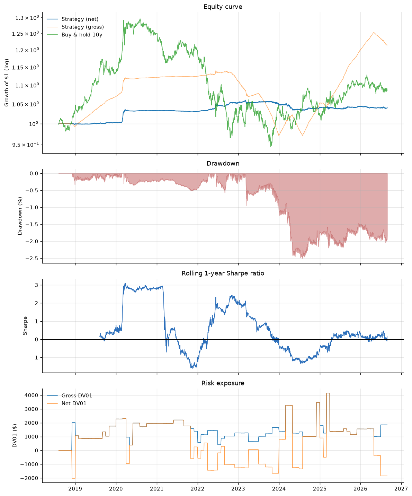

# Treasury Quant Engine

An end-to-end quantitative research system for the US Treasury market: yield-curve
modelling, machine-learning return forecasting, risk-aware portfolio
construction, cost- and financing-accurate backtesting, and automated execution
with pre-trade risk controls.

Built on **36 years of real Treasury data** (9,172 trading days, 1990–2026) from
Treasury.gov and FRED. No paid data, no vendor libraries — the bond maths, the
curve models and the backtester are implemented from first principles.

```bash
git clone https://github.com/sanskar-94/treasury-quant-engine.git
cd treasury-quant-engine
python3 -m venv .venv && ./.venv/bin/pip install -e ".[all]"
./.venv/bin/tqe pipeline        # data → curve → features → train → backtest
```

---

## The headline

**The model has genuine skill at the front of the curve and none at the long
end, and what it has does not survive being made market-neutral.** That is the
finding. The engineering worth reading is what it took to get to a number that
means anything - four bugs, three of them capable of manufacturing a result, and
one that was quietly destroying three quarters of the signal.

Walk-forward out-of-sample, 2018-08 to 2026-08 (2,016 trading days, 8 folds):

| Information coefficient | 3 Mo | 6 Mo | 1 Yr | 2 Yr | 5 Yr | 10 Yr | 30 Yr |
| --- | ---: | ---: | ---: | ---: | ---: | ---: | ---: |
| OOS IC | **+0.124** | **+0.154** | **+0.092** | +0.004 | +0.010 | −0.003 | −0.002 |

The front end is genuinely forecastable - the Fed telegraphs its path, and bills
and 1-year notes price it mechanically. Past two years there is nothing. That
gradient is the most economically sensible thing this project produced.

Turning it into a portfolio:

| Construction | Sharpe | p vs own controls | Reading |
| --- | ---: | ---: | --- |
| Directional, funded | **+0.51** | 0.024 | still carries a funding position |
| **Double-neutral, funded** | **+0.14** | **0.122** | the honest number |
| Deflated Sharpe (145 configs) | **0.111** | — | ~11% chance it survives multiple testing |

So: a real edge, in a specific place, too small to clear the bar once the
funding channel is removed and the search width is accounted for. Not nothing,
and not tradable.



---

## Four bugs, and why three of them flattered the result

### 0. A one-day misalignment that destroyed most of the signal

`build_features` lags `X` by one day so `X[t]` holds `t-1` information.
`make_targets` *also* led `y` by one day. Both shifts were individually
documented and individually sensible; together they aimed every forecast one
session past the day the backtest trades it.

| | corr with prediction |
| --- | ---: |
| `return[t+1]` — what the model forecast | **+0.0375** |
| `return[t]` — what the backtest harvested | **+0.0095** |

Three quarters of the signal, discarded by a single shift. Fixing it took the
backtest Sharpe from 0.12 to 0.51.

This one is worth dwelling on because it is the *opposite* of the usual failure.
A leak announces itself with an implausible Sharpe and invites scrutiny. This
error was conservative - it produced disappointing numbers that looked exactly
like an honest negative result, and so nobody looks for it. It was found only
because a separate experiment produced an absurd Sharpe of 9.6 and the audit
that followed checked the alignment of everything.

### 1. Financing was never charged

`CostConfig` had a repo spread. `BacktestConfig` had `include_financing`. The
P&L loop called neither. Positions earned their full total return with no charge
for the money used to hold them.

That sounds like a rounding error. It is not, because a three-month Treasury
bill is nearly riskless: over this window it returned 2.81% at almost zero
volatility, so **an unfunded backtest scores holding cash at a Sharpe above 12.**
Any strategy with a net long bias inherits an enormous fictitious edge. This one
was 72% net long at 3.7× gross leverage.

With `net_notional × funding_rate × days/360` charged on the net book — longs
pay, shorts receive, ACT/360 per the repo convention — the strategy earns 0.13%
a year against a 2.56% financing drag.

Decomposing what remains is worse:

| Component | Annualised |
| --- | ---: |
| Market P&L (positions × returns) | **−1.53%** (Sharpe −1.46) |
| Financing contribution | **+2.41%** |
| Transaction costs | −0.09% |
| **Net** | **+0.78%** |

The positions *lose* money. The only positive contribution is financing, because
the book is systematically short notional when rates are high (corr −0.44). That
is a cash carry trade, not a forecast.

### Proving it properly

Correlation of −0.44 could be luck. So the book was projected onto the null
space of **both** the cash vector and the DV01 vector — zero net funding, zero
net duration, pure relative value — and run against a placebo battery:

| | Sharpe |
| --- | ---: |
| Real predictions | **+0.05** |
| Time-shuffled predictions (10 draws) | −0.12 ± 0.16 |
| Tenor-shuffled predictions (10 draws) | −0.34 ± 0.37 |
| Sign-flipped | −0.16 |

2 of 20 placebos beat the real signal (p ≈ 0.14), and the real result sits 0.9
standard deviations above the placebo mean. **Indistinguishable from noise.**

A front-end IC of +0.12 is a real correlation. It is not, on this evidence, a
tradable edge.


---

## Why this is the useful outcome

A daily-frequency Treasury strategy with a genuine post-cost, post-funding
Sharpe above 1 would be a significant discovery, not a weekend project. The
prior should be that it does not exist. What a system like this is for is
establishing that rigorously enough to believe the answer — and the four bugs
below were each capable of manufacturing one, three of them found by *running*
the system rather than reading it.

### Financing, in more detail

Covered above. Cost: a Sharpe of 2.4 out of thin air. Now pinned by five
regression tests, including one asserting that a book long a riskless instrument
yielding the funding rate earns ~0 when funded and >5 Sharpe when not.

### 2. A DV01 cap is not a leverage cap

The sizing layer enforced a $25,000 gross DV01 limit while running **$148mm of
notional on $10mm of capital** — 14.9× leverage — entirely inside its risk
limit. A 3-month bill has ~1/65th the DV01 of a 30-year, so equal *risk* means
65× the *notional* at the front end. Costs and funding are both charged on
notional.

### 3. Z-scoring a return forecast destroys it

Across a 64-configuration sweep, all 32 `vol_scale` variants produced a positive
net Sharpe and all 32 `zscore` variants a negative one. The model forecasts a
*return*, so zero means "no move expected" — a meaningful point. Subtracting a
trailing mean replaces it with "unusually bullish lately", which is a different
and actively harmful statement.

### 4. The look-ahead canary was testing nothing

Three definitions were needed before it measured anything real:

- *Shift the signal forward.* Proves nothing: `signal[t+1]` forecasts
  `return[t+1]`, so trading day *t* with it merely misaligns it.
- *Re-size a `sign(return)` signal through the pipeline.* The no-trade band and
  monthly schedule throttle the canary too, so "perfect foresight" scored
  **below** the honest run.
- *Keep the strategy's own position sizes, flip each to the sign of the
  **relative** return, hold cash neutral.* This works — 14.65 against an honest
  0.13, ratio 0.009.

The middle failure is worth dwelling on: a canary that scores badly looks
reassuring and is easy to accept.

---

## How look-ahead bias is prevented

- **One causality boundary.** Every feature block is causal as of its own close;
  exactly one line — `X.shift(feature_lag)` in
  [`features/builder.py`](src/tqe/features/builder.py) — moves the matrix to
  prediction time. Enforcing it twice is how double-lagging happens.
- **Real publication lags.** January CPI is stamped `1990-01-01` in FRED but
  released in mid-February; forward-filling it hands the model three weeks of
  foresight. [`features/macro.py`](src/tqe/features/macro.py) shifts each series
  by its actual release lag *before* it reaches the daily grid. NBER recession
  dates get 400 days.
- **Purging and embargo.** Training rows whose forward label overlaps the test
  block are dropped, plus an embargo after it. `validate_splits` audits the
  scheme before training and raises on violation — the test suite feeds it a
  deliberately leaky split to confirm it fails.
- **Causal PCA.** Loadings for day *t* use only data through *t−1*. The test
  corrupts the last third of the sample by 25× and asserts earlier factor scores
  are bit-identical.
- **Per-fold scaling.** The scaler is refitted inside each fold on training data
  only.
- **Deflated Sharpe.** All 145 searched configurations are counted, not the one
  that won.

---

## Architecture

```
src/tqe/
├── pricing/       bond maths — day counts, price/yield, duration, convexity, DV01, KRD
├── data/          Treasury.gov + FRED loaders, SIFMA calendar, total-return universe
├── curve/         Nelson-Siegel-Svensson, bootstrapping, PCA, dynamic NS + VAR
├── features/      technical, macro (lag-aware), regime blocks → design matrix
├── models/        ridge/elastic-net/RF/GBM + baselines, stacked ensemble, registry
├── training/      walk-forward splits with purging, metrics, nested tuning
├── signals/       forecast → signal → DV01-sized position
├── portfolio/     optimiser, covariance, VaR/ES, stress, RV structures, KRD hedging
├── backtest/      event-driven engine, 32nds costs, financing, attribution, tearsheets
├── execution/     broker protocol, paper broker, Alpaca adapter, risk gate, OMS
├── live/          daily trading loop
├── viz/           curve, factor, attribution and signal diagnostics
├── api/           FastAPI service
└── cli.py         tqe data | curve | features | train | backtest | predict | trade | serve
```

Interface contracts and the six places the implementation deliberately departed
from them: [`docs/ARCHITECTURE.md`](docs/ARCHITECTURE.md).

### Pricing core

Validated against closed-form results, never against its own output:

| Property | Result |
| --- | --- |
| Zero-coupon Macaulay duration == maturity | exact to 1e-10 |
| Par bond prices at its own coupon | exactly 100.000000 |
| Price ↔ yield round trip | 9.1e-14 |
| Σ key-rate durations == effective duration | 8.077947 vs 8.077948 |
| Bootstrapped zeros reprice input par bonds | 1.4e-13 |

Accrued interest uses ACT/ACT (ICMA); settlement follows the real T+1/T+2 split
at 2024-05-28; the calendar computes Good Friday from the Gregorian Easter
algorithm and includes one-off closures such as the 2012 Hurricane Sandy
shutdown.

### From yields to P&L

The Treasury publishes *par yields*, not prices.
`constant_maturity_total_return` builds the synthetic on-the-run par bond each
day — which prices at exactly 100 by construction — then reprices **that same
bond** at the next day's yield, one day shorter, plus coupon accrual.

| Tenor | Ann. return | Ann. vol | Mean DV01 (per 100) |
| --- | ---: | ---: | ---: |
| 3 Mo | 2.89% | 0.28% | 0.0025 |
| 2 Yr | 3.47% | 1.71% | 0.0192 |
| 10 Yr | 4.88% | 7.46% | 0.0813 |
| 30 Yr | 5.26% | 14.24% | 0.1648 |

Monotone in tenor for both return and risk; the 10-year matches published index
history. Cross-checked against `−D·Δy + ½C·Δy²` to 0.025bp.

### Curve modelling, and a note on identifiability

NSS fits the real curve to **1.0bp RMSE** across 14 tenors, but the
parameterisation is **not identifiable** — many (β, τ) combinations are
observationally equivalent. Fitting all six freely gives an excellent curve and
useless parameters. Following Diebold & Li (2006), fixing the decays:

| | Free τ | Fixed τ (1.37, 8.0) |
| --- | ---: | ---: |
| β₃ standard deviation | 1.6479 | **0.0308** (53× more stable) |
| β₃ 99th-pct daily change | 2.2534 | **0.0100** (226×) |
| Fit RMSE | 2.98bp | 7.62bp |
| Runtime, 9,172 days | 43.6s | **1.0s** |

The fixed-τ factors are economically meaningful: `corr(β₀+β₁, 3-month yield) =
0.998`. Free τ is available for pricing, where fit quality matters; fixed τ
feeds the model, where stability does.

PCA on daily yield changes gives **77.2% / 13.3% / 5.0%** for level / slope /
curvature. (The often-quoted 90/7/2 applies to a narrower 2y–30y set.)

### Costs and financing

Half-spreads in **32nds of a point**, plus square-root impact and commission;
funding at the bill yield plus the configured repo spread.

```
$10mm on-the-run 10y   spread 0.5/32 = 1.56bp of price
                       spread cost   $1,562.50
                       impact           $3.31
                       commission     $125.00
                       total        $1,690.81  (1.69bp)
```

### Execution

- `PaperBroker` with correct accounting through a sign flip — buy 100 @ 100,
  sell 60 @ 110, sell 60 @ 120 realises exactly $1,400 and leaves a short 20 at
  an average of 120. That is the classic bug, so it is a test.
- `AlpacaBroker` implementing the same protocol; defaults to the paper endpoint
  and refuses the live one without `allow_live=True`.
- `RiskGate` with hard limits (order/position notional, gross/net DV01, daily
  loss, drawdown, orders per day) and a kill switch that stays tripped until
  explicitly reset.
- `OMS` that is **idempotent** — running the same day twice generates zero
  orders the second time — reconciles against broker state, and persists to disk.
- Live trading is `dry_run=True` by default and additionally requires
  `--live --yes`. The HTTP API physically cannot place an order.

---

## Usage

```bash
tqe data pull                    # 36 years of curve + 16 FRED series (cached)
tqe curve fit                    # NSS betas, bootstrapped zeros, causal PCA factors
tqe features build               # 489 features × 6,952 rows
tqe train                        # walk-forward + deployable bundle
tqe backtest --n-trials 145      # costs, financing, tearsheet, deflated Sharpe
tqe predict                      # next session's forecast per tenor
tqe trade --dry-run              # full live path, no orders sent
tqe serve --port 8000            # FastAPI
```

`make all` runs the whole pipeline. `python scripts/smoke_test.py` exercises
every seam on synthetic data in about a minute — 45 checks, no network.

---

## Testing

```bash
make test
```

315 tests. Numerical code is checked against closed-form results and invariants,
never against values copied from its own output. The suite leans on negative
controls:

- a deliberately leaky split that `validate_splits` must reject,
- a future-corruption test the causal PCA must survive bit-identically,
- a backtest whose positions must not move when one day's return is multiplied
  by 50,
- an unfunded riskless-carry book that must score >5 Sharpe, and ~0 when funded,
- a deflated Sharpe that must fall as the trial count rises.

---

## Following up the negative result

The two most obvious explanations for the failure — wrong horizon, wrong target
definition — were tested rather than left as speculation
([`scripts/experiment_horizons.py`](scripts/experiment_horizons.py), results in
[`results/horizon_experiment.csv`](results/horizon_experiment.csv)).

Six cells: `{total_return, relative_return}` × `{1, 5, 21}` day horizons. Each is
walk-forward trained, then evaluated as a **double-neutral funded book** (zero
net cash, zero net DV01, costs and financing charged) against 40 controls.

**Information coefficient by horizon:**

| Target | 1 day | 5 days | 21 days |
| --- | ---: | ---: | ---: |
| `total_return` | **+0.025** | −0.072 | −0.174 |
| `relative_return` | **+0.021** | −0.084 | −0.191 |

The edge is confined to one day and **reverses** as the horizon lengthens — for
both target definitions, monotonically. That is what a momentum-heavy feature
set does on an asset that mean-reverts over weeks: it keeps extrapolating a move
that has already turned. Longer horizons do not rescue this model; they invert it.

**Significance, after correcting for having looked six times:**

| | |
| --- | ---: |
| Nominally significant (p ≤ 0.10) | 1 / 6 |
| Significant after Holm correction | **0 / 6** |
| P(at least one p < 0.05 by luck across 6 tests) | 26% |

The single nominal hit (`total_return`, h=5, p = 0.049) has an IC of **−0.072**.
A model that anti-predicts its own target while appearing to make money is
reporting luck, and one such cell out of six is exactly the yield of pure chance.

### The null had to be rebuilt first

The initial run used time-shuffled predictions as the control and reported 2 of 6
cells significant. **That was wrong.** Shuffling preserves each tenor's *mean*
prediction, and because the raw forecasts rise monotonically with maturity, a
shuffled signal smoothed over ten days becomes a large near-static curve tilt —
the shuffled books held −$18mm of 3-month against +$10mm of 1-year, roughly ten
times more concentrated than the real book. The controls were a different and
more aggressive strategy, not an absence of signal, and their Sharpe was not
centred on zero.

The null used instead is a **block sign-flip**: multiply the finished signal by a
random ±1 drawn once per 63-day block. That preserves magnitude, autocorrelation,
persistence and cross-sectional structure — everything about the book except its
alignment with future returns, which is exactly the hypothesis under test. With a
valid null the placebo means sit within ±0.11 of zero and the apparent findings
disappear.

### Acting on the diagnosis: mean-reversion features

The IC pattern is not just a failure, it is a *diagnosis* — a momentum-heavy
feature set extrapolating a move that has already turned. So the indicated fix
was built and measured: **rich/cheap residuals** (market yield minus the
NSS-fitted yield, in bp — the canonical rates relative-value signal, and
machinery the project already had but was throwing away) plus explicit
**reversal, acceleration and volatility-scaled extension** features. 482
features became 613.

| IC | 1 day | 5 days | 21 days |
| --- | ---: | ---: | ---: |
| Momentum only | +0.025 | −0.072 | −0.174 |
| **+ mean reversion** | +0.024 | **−0.046** | **−0.132** |

The diagnosis was right and the fix works where it was aimed — roughly a third of
the degradation removed at 5 and 21 days. It is **not enough to flip the sign**,
and 0 of 6 cells remain significant after correction.

**And at the horizon this system actually ships with, it made things worse.**
Retraining the full ensemble on all 613 features (measured *before* the
alignment fix above, so the absolute ICs are the old, misaligned ones; the
comparison between the two feature sets is still like-for-like):

| | 482 features | 613 features |
| --- | ---: | ---: |
| Pooled OOS IC (h=1) | **+0.029** | +0.011 |
| Backtest Sharpe (funded) | **+0.12** | −0.06 |

The extra 131 features are mostly noise at daily frequency, and the stacked
ensemble had less signal to work with, not more. So the blocks ship **default
off**, with the config comment recording exactly when to turn them on: alongside
a weekly or monthly target, which is the direction the horizon results point in.
A feature that helps at one horizon and hurts at another is a configuration
decision, not a bug — but only if the measurement is written down.

### The benchmark that actually matters: carry

Comparing a rates model to cash, or to buy-and-hold, flatters it. The honest
benchmark is **carry** — the yield pickup over funding plus the roll down the
curve — because that is the dominant systematic return driver in fixed income
and it requires no model at all. A mechanical carry signal was built and put
through the identical evaluation
([`scripts/benchmark_carry.py`](scripts/benchmark_carry.py)):

| Signal | Sharpe | p vs own controls | Turnover |
| --- | ---: | ---: | ---: |
| Carry alone | −0.18 | 0.81 | 8.2× |
| Model alone | **+0.05** | 0.27 | 18.5× |
| Carry + model | −0.19 | 0.73 | 11.3× |

The model beats carry — but only because **carry itself lost money over this
window**, and neither is remotely significant. The blend is worse than either,
so the forecast adds nothing to carry.

Carry's failure is not noise, it is regime. Year by year against the 2s10s slope:

| Year | Carry return | 2s10s (year-end) |
| --- | ---: | ---: |
| 2020 | **+1.79%** | +80bp |
| 2021 | −3.44% | +79bp |
| 2022 | **−4.29%** | **−53bp** |
| 2023 | +0.24% | −35bp |
| 2025 | **+2.05%** | +71bp |

A relative-value carry book is long the carry-rich part of the curve, which is
the long end — and the long end is exactly what sells off when a hiking cycle
inverts the curve. Carry is a regime-dependent factor, not a free lunch, and
2018–2026 contained the worst regime for it in four decades. That is worth
knowing before concluding that a model "beat carry".

### A dynamic term-structure model, and the trap for the third time

Forecasting nine tenors separately is backwards for a yield curve, which is one
object with three degrees of freedom rather than nine loosely related assets.
[`curve/dynamic.py`](src/tqe/curve/dynamic.py) implements the Diebold-Li
two-step: fix the decay so the Nelson-Siegel betas are identified, then fit a
VAR to the factor series and iterate it forward. Three persistent factors
instead of nine noisy returns, and every forecast is a curve the model can
actually produce.

It works, on its own terms. Rolling out-of-sample over 9,172 days in 1.4
seconds, the predicted one-day yield change has an **IC of +0.0295, positive on
all nine tenors**. That figure is measured directly against realised yield
changes, so it is unaffected by the target-alignment bug — three factors and no
feature engineering, matching what the 482-feature pipeline achieves.

Run as a directional strategy it looked better still:

| | Sharpe | Turnover |
| --- | ---: | ---: |
| ML ensemble | +0.12 | 20.9× |
| **DNS VAR** | **+0.41** | 6.7× |

**And then it collapsed.** Under the double-neutral funded construction — zero
net cash, zero net DV01 — DNS scores **−0.18 (p = 0.61)** against its own
block-sign-flip controls, worse than the ML model's +0.05. The +0.41 was the
funding channel again.

That is the third time this project produced an impressive number that was a
funding position wearing a forecast's clothes: once for the ensemble, once for
carry, once for DNS. The pattern is worth naming, because it is not obvious and
it is not rare — **any signal with a persistent directional tilt will pick up
the cash-versus-duration trade, and over 2018–2026 that trade paid.** The only
defence is to neutralise the channel before measuring, every time, without
exception.

### Where the P&L actually came from

[`backtest/attribution.py`](src/tqe/backtest/attribution.py) decomposes realised
P&L two ways, both reconciling to the engine's own numbers to 1e-11.

By source, annualised: market P&L **+2.78%**, financing **−2.56%**, costs
**−0.09%**, net **+0.14%**. By curve factor:

| Factor | Annualised P&L | Share of gross risk |
| --- | ---: | ---: |
| Level | **−0.10%** | 42.1% |
| Slope | **+0.42%** | 33.1% |
| Curvature | **+0.24%** | 13.7% |
| Residual | +0.03% | 11.1% |

Three factors explain 93.8% of the P&L variance. The model earns on **slope and
curvature** and loses on **level** — it has curve-shape skill and no directional
skill, while carrying its largest risk exposure precisely where it has no edge.
That is a specific, actionable diagnosis, and it is invisible in a Sharpe ratio.

### Re-validating everything after the alignment fix

Every experiment in this project was originally run against the misaligned
target, and the conclusions were published on that basis. Fixing the alignment
invalidated the inputs to all of them, so they were re-run rather than assumed
to still hold.

| Experiment | Original conclusion | After the fix | Holds? |
| --- | --- | --- | :-: |
| Horizon × target (6 cells) | IC degrades and reverses with horizon; 0/6 after Holm | IC +0.012 / −0.062 / −0.154 at 1/5/21 days; 0/6 after Holm | ✅ |
| Carry benchmark | Carry loses; model beats it; blend adds nothing | carry −0.20 (p=0.78), model **+0.14** (p=0.12), blend −0.21 | ✅ |
| Turnover defaults (54 configs) | monthly / band 2.0 / halflife 10 / deadband 0.10 | same config ranks **3 of 54**; every lever conclusion unchanged | ✅ |
| DNS vs ML | DNS's +0.41 is a funding artifact | DNS **−0.19** (p=0.63) vs ML +0.14 (p=0.12) | ✅ |

All four survive. The defaults were deliberately **not** re-tuned to the new
maximum — daily rebalancing now edges monthly out at +0.54 against +0.43, but
at 35× turnover against 19×, and chasing that would be exactly the
multiple-testing behaviour this project spends its time criticising. Ranking 3rd
of 54 with far better cost robustness is the right place to stand.

Re-run evidence is committed as `*_v2.csv` / `*_v3.csv` in
[`results/`](results/), alongside the originals, so the before-and-after is
checkable rather than asserted.

### Trading the structures natively — and DV01-neutral is not funding-neutral

The attribution said the skill is in slope and curvature while 42% of the risk
sits in level. The indicated fix is to trade **DV01-weighted structures**
directly — steepeners and butterflies that cannot express a level view at all —
rather than trading nine tenors and projecting the exposure away afterwards
([`scripts/structure_strategy.py`](scripts/structure_strategy.py)).

Ridge forecasts of structure returns reach an out-of-sample **IC of +0.101**,
an order of magnitude above the tenor-space model. The first run scored
**Sharpe 3.96**.

It was wrong, and the way it was wrong is the most useful thing in this section.
That script computed its own P&L: it charged transaction costs and omitted
financing — precisely the bug the engine had been fixed for weeks earlier,
reintroduced by a helper that bypassed the engine. Charging funding properly:

| | Hand-rolled P&L | Delegated to the engine |
| --- | ---: | ---: |
| Sharpe | **3.96** | **+0.04** |
| Financing drag | not charged | **28.4% p.a.** |

Twenty-eight percent. **A DV01-neutral structure is not a cash-neutral one, and
the two are easy to conflate.** A steepener matches the DV01 of its legs, so the
short leg has to be enormous relative to the long one — a 2s10s steepener is
about +$5.3mm against −$1.3mm — leaving it hugely net long notional. It is a
levered cash position wearing a curve trade's clothes. The static 3-month/2-year
steepener scoring a buy-and-hold Sharpe of 8.1 in the table above is the same
effect in its purest form, and should be read as a warning label rather than an
opportunity.

With funding charged, the structure model reaches Sharpe +0.04 at p = 0.27.
Expressing the view natively does not rescue it either.

`evaluate()` now delegates to `run_backtest` instead of reimplementing the
accounting. That is the actual lesson: **there should be exactly one place in a
system that turns positions into P&L**, and every experiment should go through
it. Five separate times in this project a number was inflated by a funding
position that a bespoke P&L path had not charged for.

---

## What I'd do next

1. **Cash-neutral structures.** Trading structures natively was tried and the
   funding leg ate it (28.4% p.a.). The next version has to constrain net
   *notional* as well as net DV01 — a steepener financed by an offsetting bill
   position rather than by borrowing, which is how a desk would actually put it
   on.
2. **Push the mean-reversion work further.** Rich/cheap and reversal features
   removed about a third of the IC degradation but did not flip its sign. The
   residuals are currently taken against a curve fitted to that day alone;
   measuring dislocation against a *fitted equilibrium over time* — an
   error-correction formulation — is the natural next step.
2. **Regime-conditional carry.** Carry works when the curve is steep and stable
   and fails through an inversion. Conditioning it on the slope regime — which
   the feature set already labels — is the obvious refinement, and more likely to
   pay than another learner.
4. **A term-premium model.** The directional question — should you be long
   duration at all — is better answered by a term-premium estimate (ACM-style)
   than by daily return forecasting.
5. **The stacked ensemble shrinks hard** — NNLS weights sum to ~0.003, so its raw
   output carries almost no scale. A calibrated formulation would be cleaner than
   the `scale_to_return_units` rescaling that currently patches it.
6. **ETF proxies, not cash bonds.** Execution maps tenors onto SHY/IEI/IEF/TLT
   because they are reachable from a retail broker; durations are approximate.

---

## Data sources

- **US Treasury** — Daily Par Yield Curve Rates (CMT), 1990–present. Coverage is
  genuinely ragged and handled rather than papered over: the 20y starts 1993-10,
  the 30y has a real gap from 2002-02 to 2006-02, and a 1.5-month tenor appeared
  on 2025-02-18.
- **FRED** — 16 macro and market series. `scripts/fetch_macro.py` handles FRED's
  undocumented burst rate-limiting, which manifests as hung connections rather
  than HTTP 429.

Both are public and need no API key.

---

## Disclaimer

Research and educational software. Not investment advice. The backtest is a
simulation, and this one reports a negative result: do not trade it.

## Licence

MIT
